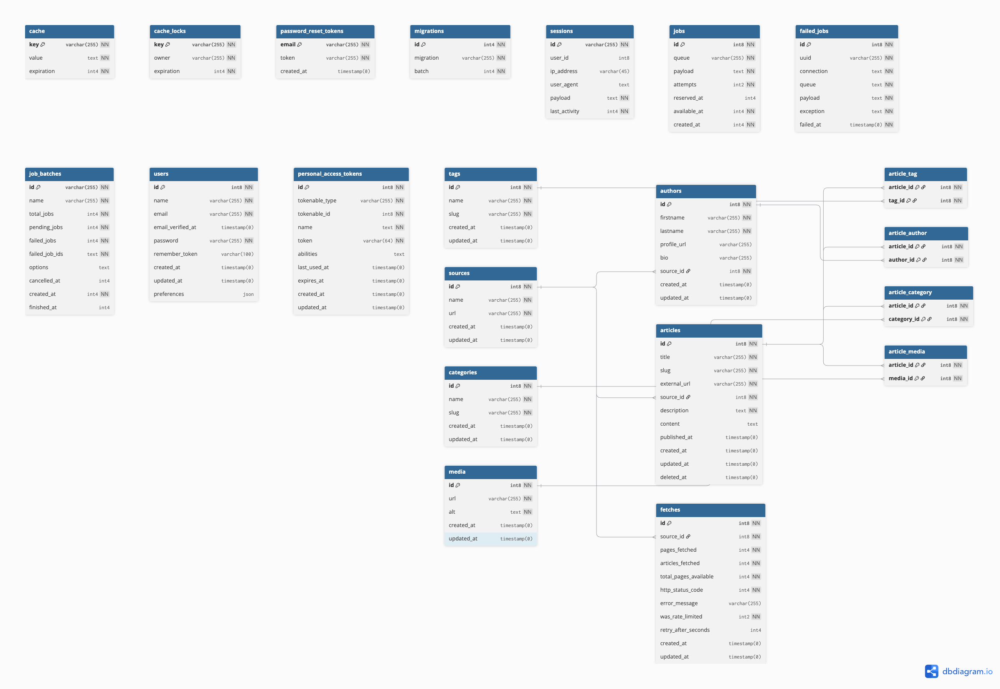

### News Aggregator API
This project features APIs for accessing news from various sources including NewYorkTimes, Guardian, and BBC (through NewsAPI.org)!

To get started, clone this repository using:
````
git clone git@github.com:goodhands/newsource.git
````

Install Composer dependencies with:
````
composer install
````

Run database migrations:
````
php artisan migrate --db=seed
````

### Using the API
To use the API, you need to request an access token for your account. One will be issued to you after creating an account with:
````
curl --location 'http://localhost:8000/api/register' \
    --header 'Accept: application/json' \
    --form 'name="Samuel Olaegbe"' \
    --form 'email="olaegbesamuel@gmail.com"' \
    --form 'password="password"' \
    --form 'password_confirmation="password"'
````

The request above will return a token that looks like `1|ZmcoF****************` if your account was created successfully or a validation error if you have missed some of the details.

Now, with this token you can make requests to the article endpoints to fetch the latest news from top news sites:

1. Get all recent articles: `http://localhost:8000/api/articles`
2. Get a single article with the author details: `http://localhost:8000/api/articles/1?include=authors`
3. Search for a headline or content you're interested in: `http://localhost:8000/api/articles?search=Arsenal`
4. Fetch all categories: http://localhost:8000/api/categories
5. Filter articles by a category: http://localhost:8000/api/articles?filter[category]=Technology
6. Fetch all authors: http://localhost:8000/api/authors
7. Filter articles by author: http://localhost:8000/api/articles?filter[author]=Samuel Olaegbe
8. Fetch all tags: http://localhost:8000/api/tags
9. Fetch articles by tag: http://localhost:8000/api/articles?filter[tag]=Tag
10. Set your preferences: http://localhost:8000/api/user_preferences

See full postman collection [here](https://food16court.postman.co/workspace/Samuel~9704ae0c-e1ef-4647-880a-b72bd635a0ea/collection/11545726-08409c14-921b-473d-b1d4-9508959ffebb?action=share&creator=11545726)

### Project design and architecture
This project was designed with testability and extensibility in mind. This informed the decision to use a domain driven design pattern along with the repository and strategy design pattern.

**Why?**
DDD: Allows us to group relative files together for easy management
Repository: Allows us to separate our business logic from our application logic
Strategy: Allows us to implement aggregate news from various sources using dedicated strategies for each source

### Fetching new articles
Before fetching new articles, you need to provide the following environment variables:
```
GUARDIAN_API_KEY=
NYTIMES_API_KEY=
NEWS_API_KEY=
```
These API keys can be gotten from the following URLs:
1. [NYTimes](https://developer.nytimes.com/docs/archive-product/1/overview)
2. [NewsAPI.org](https://newsapi.org/docs/get-started)
3. [Guardian](https://open-platform.theguardian.com/documentation/)

To fetch new articles from all sources, run the artisan command:
```
php artisan articles:fetch
```

This will perform some checks to make sure it's not fetching duplicate articles and after that check is complete, it will fetch new articles from the sources that have were seeded.

This command has also been scheduled to run hourly to fetch new articles from these sources. You will need to configure a cron job to run every the `php artisan schedule:run` command every minute to get this working.

### Database design

